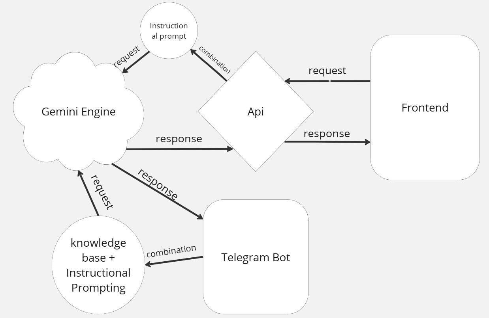

# Agentic HR

### 1. Presentation
### 2. Business Problem
### 3. Solution
### 4. Project Architecture
### 5. Demos
### 6. Demo tutorials
### 7. Project Repositories

## Presentation
Agentic HR: Revolutionizing the Job-Seeking Journey with AI-Powered Solutions

Agentic HR is a state-of-the-art, AI-driven platform meticulously designed to redefine and elevate the job-seeking experience. By seamlessly combining advanced artificial intelligence with user-friendly, intuitive tools, Agentic HR empowers job seekers to achieve their career goals with efficiency and confidence.

This innovative platform simplifies the complexities of job hunting, enabling users to craft highly personalized, professional-grade resumes, uncover tailored job opportunities, and manage applications seamlessly—all while requiring minimal time and effort. Agentic HR is built to cater to modern job seekers, ensuring they remain competitive in a fast-evolving employment landscape.

At its core, Agentic HR achieves its mission through a suite of powerful features, including:

AI-Generated Resume Builder
Leveraging cutting-edge AI algorithms, this feature allows users to create polished, customized resumes that highlight their unique skills, experiences, and accomplishments. The tool adapts to various industries and roles, ensuring the final product resonates with potential employers.

Automated Job Search
Agentic HR streamlines the job-hunting process by identifying and curating opportunities that align with users’ profiles, preferences, and career aspirations. This feature eliminates the need for endless scrolling through job boards, saving time while delivering highly relevant results.

Smart Application Management
Users can efficiently track and manage their job applications in one centralized location. The platform provides real-time updates, reminders, and insights into application statuses, helping job seekers stay organized and proactive.

Personalized Job Recommendations
By analyzing user data and preferences, Agentic HR delivers tailored job suggestions that align with individual career goals. This ensures users are consistently presented with opportunities that match their skills and ambitions, maximizing the chances of success.

Agentic HR isn’t just a tool; it’s a transformative ally for job seekers, designed to simplify, personalize, and optimize every step of the job-seeking journey. Whether you’re a seasoned professional seeking a career pivot or a fresh graduate stepping into the workforce, Agentic HR empowers you to take control of your career path like never before.

Kindly download the pdf presentation below

#### [Download](./presentation.pdf)

## About

## Business Problem

## Solution

## Project Architecture
The Architectural diagram below shows a visual representation of data flow in Agentic HR project.

## Demo tutorials

## Demos
1. [BOT](https://t.me/hr_agentic_bot)
2. [Website](https://agency-hr.vercel.app)

## Project Repositories
1. [Agentic_Hr Bot](https://github.com/ukangaekom/hr_gemini)
2. [Frontend]()
3. [Agentic_HR API](https://github.com/AHKAYY007/agentic_hr_api)